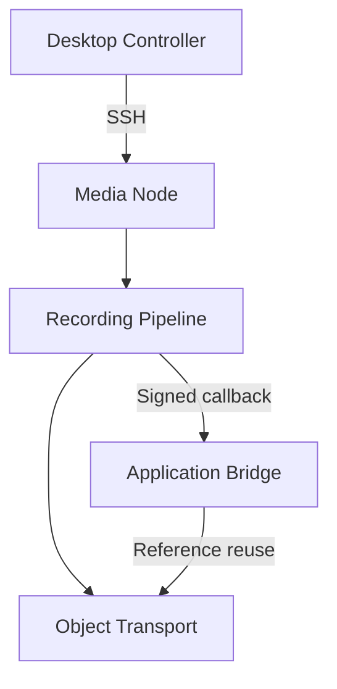

# Deterministic Media Control Plane

Current release: `1.3.11`

An idempotent control plane for provisioning a single-node, WebRTC-oriented media workload, publishing composite recording artifacts, maintaining bounded retention, and relaying immutable media references through an external object transport.

## System topology

## Properties

- Idempotent preflight and provisioning stages
- Server-managed provisioning that survives controller or SSH disconnection
- Automatic healthy, partial, and absent installation detection
- Package repair, protected configuration backup, and bounded final recovery
- Ubuntu 22.04 and BigBlueButton 3.0 target profile
- Presentation and composite H.264 recording workflows
- Local Telegram Bot API transport for objects up to 2000 MB
- HMAC-authenticated application callbacks with replay protection
- Append-only WordPress schema migration
- Bounded raw, presentation, and local composite retention
- One-at-a-time conversion and upload queues
- Health, disk-pressure, TLS, service, and recording diagnostics
- Dry-run mode for every destructive maintenance operation
- Greenlight v3 deployment and direct administration access
- Persistent workstation profile with operating-system credential storage
- Progress indication, copyable logs, and exportable diagnostic reports
- Start, stop, restart, repair, queue, and service-log controls
- Greenlight database repair before administrator provisioning
- Required-service diagnostics in the copyable operation log

## Quick start

1. Create an `A` record for the selected media hostname and point it to the node's public IPv4 address.
2. Wait until public DNS resolves to that address.
3. Install Python 3.11 or later on the administration workstation.
4. Run `python controller.py` and enter the connection, WordPress, and Telegram values.
5. Select **Preflight**.
6. Run **Provision** after every mandatory check passes. Re-running it resumes or repairs an earlier incomplete installation.
7. Install and activate the generated WordPress bridge ZIP.
8. Select **Copy Bridge Config** and save both values under Tools, Recording Transport.
9. Select **Activate Telegram** in the Management tab.

Provisioning deliberately leaves the existing bot on the cloud API until the authenticated WordPress bridge is ready. The final activation preserves the current webhook, logs the bot out of the cloud Bot API, attaches it to the loopback-only Bot API, restores the webhook, verifies the new transport, and only then starts the recording worker.

Provisioning runs as a transient systemd service on the node. Closing the controller does not stop it. A later Provision action attaches to an active run. The recovery state machine first keeps a healthy installation, then repairs package state and reruns the idempotent upstream installer. Only after two failed recovery attempts does it back up configuration, purge partial BBB packages, and perform one bounded final installation. It never removes `/var/bigbluebutton` recording storage.

Secrets are never committed. The controller generates the bridge secret, transmits the node configuration through SSH with mode `0600`, removes staging material after installation, and stores a private local recovery copy outside the source tree.

## Repository layout

| Path | Responsibility |
|---|---|
| `controller.py` | Local graphical controller and SSH orchestration |
| `assets/` | Bundled VT323 interface font and license |
| `provision/` | Idempotent node bootstrap and systemd assets |
| `worker/` | Recording validation, transport upload, callback, retention |
| `wordpress/` | Additive application bridge |
| `patches/` | Minimal compatibility patch for the existing application |
| `docs/` | Deployment, security, recovery, and operations references |
| `tests/` | Unit and migration-safety checks |

## Safety contract

The project does not delete application bookings, learning sessions, existing recording links, WordPress users, or payment data. New persistence uses an isolated table. Local media deletion requires a verified Telegram object reference and expiry of the configured grace period.

## Documentation

- [Deployment](docs/DEPLOYMENT.md)
- [Architecture](docs/ARCHITECTURE.md)
- [Operations](docs/OPERATIONS.md)
- [Security](docs/SECURITY.md)
- [Recovery](docs/RECOVERY.md)

## License

MIT
