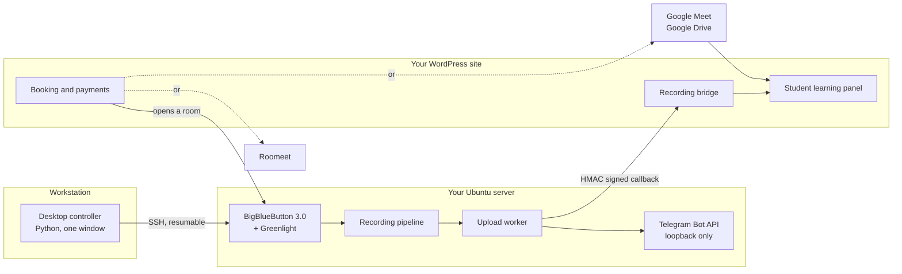

<div align="center">

# Klassenraum

**A self hosted teaching platform for people who actually teach.**

Run your own live classrooms, sell and schedule the lessons, deliver the
recordings, and give every student a learning panel that remembers what they
did. One repository, one operator, no seat licences.

[](https://github.com/hrschemiker/bbb-control-plane/actions/workflows/ci.yml)
[](CHANGELOG.md)
[](wordpress/german-teacher-booking)
[](docs/DEPLOYMENT.md)
[](LICENSE)

</div>

---

## The problem this solves

Teaching online usually means renting a meeting service, renting a booking
service, renting a storage service, and then gluing them together by hand every
week. The teacher becomes an operator. Recordings go missing. A student asks for
last month's video and nobody can find it.

Klassenraum replaces that pile with one system you own. A desktop app turns a
bare Ubuntu server into a complete BigBlueButton classroom in a single run. A
WordPress plugin sells the lessons, opens the rooms, and hands every student a
panel with their notes, homework, quizzes, and recordings. The two halves talk
over signed HTTP, and the media never leaves infrastructure you control.

---

## How it fits together



---

## What it does

### Live classes, four ways

Every lesson can run on whichever service suits it. The booking flow picks the
provider, creates the room, and stores one join link that the student panel and
the reminder emails both use.

| Provider | What you get |
|---|---|
| **BigBlueButton on your own server** | Full control, recordings you own, provisioned by this repository |
| **BigBlueButton, shared or hosted** | Same workflow against someone else's server |
| **Google Meet** | Calendar event with a Meet link, recording pulled back from Google Drive |
| **Roomeet** | Regional provider with its own recording API |

The join button only unlocks from three minutes before the class until it ends,
measured in Iran local time, so a link cannot leak into the wrong hour.

### Recordings that actually arrive

This is the part that normally breaks. Klassenraum treats recording delivery as
a first class pipeline rather than an afterthought.

- **Google Drive matching is scored, not guessed.** A recording is tied to a
  class using the file Google itself attaches to that calendar event, the Meet
  meeting code inside the file name, the event title and student name, how close
  the file creation time sits to the class, and whether the video length fits
  the lesson length. A video is attached automatically only when the best
  candidate is clearly ahead of the runner up. Everything else waits for a human
  and says exactly why.
- **Nothing is ever silently mismatched.** An operator screen lists every
  candidate with its score and the reasons behind it, so reattaching an old
  video to the right lesson takes one click.
- **Large files travel.** A loopback only Telegram Bot API on the server moves
  composites up to 2000 MB, far past the public bot ceiling, and the site stores
  a reusable object reference instead of a second copy.
- **Students get both.** Every recording appears in the panel with a player and
  a direct download link, and Drive files are shared automatically so the link
  opens for the person who needs it.

### A learning panel, not a link dump

Each booked lesson becomes a session with six tabs: notes, resources, exercises,
video, homework submission, and a quiz. Students see a Persian, right to left
interface with Jalali dates. Teachers see submissions, corrections, attendance,
and a performance summary.

- Lesson notes export to a real PDF, with correct bidirectional text and
  embedded fonts, because browser print output was not good enough.
- Optional AI assistance drafts reading passages and quizzes for a session and
  suggests corrections on submitted homework. It never publishes on its own.
- Notifications, homework badges, and a booking cart keep the panel usable on a
  phone.

### Selling the lessons

Class types and multi session packages with their own prices, a booking cart, a
Jalali calendar with real availability, discount codes, WooCommerce checkout or
card to card confirmation, and automatic reminders. Card order, colours, and
text on the booking screen are configurable, so the panel can match your brand
without touching code.

### A Telegram bot for the people who live there

Students can reach their bookings, class links, and recordings from a Telegram
bot, which for many learners is the only interface they will reliably open.

---

## The operator experience

The control plane exists so that running a media server does not become a second
job.

**Provisioning survives you.** The installer runs as a transient systemd unit on
the server. Close the laptop, lose the SSH session, fly somewhere: the run keeps
going, and reconnecting attaches to it.

**Provisioning is honest about failure.** It first detects whether the stack is
healthy, partial, or absent. It repairs package state and reruns the idempotent
upstream installer. Only after two failed attempts does it back up the
configuration, purge partial BigBlueButton packages, and make one final bounded
attempt. It never deletes `/var/bigbluebutton`, so recordings outlive every
repair.

**One command answers "is it fine?".**

```bash
sudo bcpctl health     # provisioning state, services, queue, disk, firewall
sudo bcpctl repair     # config permissions, SFU, HTML5 auth, Telegram, access
sudo bcpctl queue      # what is waiting to be published
```

**The site can always reach the server.** The WordPress host is resolved and
explicitly allowed in `ufw` on ports 80 and 443, with a fail2ban `ignoreip` rule
written before fail2ban starts. This closes the classic failure where the site
times out against its own classroom and nobody can tell why.

**The plugin can check itself.** A connection health screen inside WordPress
live tests the Google token, Calendar and Drive access, public sharing, the
Telegram bot and webhook, every scheduled job, the database columns, and how
many past classes still lack a recording.

---

## Quick start

### 1. The server

You need Ubuntu 22.04 with at least 8 cores, 16 GB of RAM, and 120 GB of free
disk, plus a hostname whose `A` record already points at it.

```bash
python controller.py
```

Fill in the connection, WordPress, and Telegram fields, run **Preflight**, and
then **Provision**. Re running it resumes or repairs an earlier attempt instead
of starting over. Expect the first full install to take a while: it is building
a real media stack, not a container.

### 2. The site

Install the two plugins from `wordpress/`, activate them, and paste the values
from **Copy Bridge Config** and **Copy WordPress Config** into the plugin
settings. Then open **Health check** and confirm every row is green before you
sell a single class.

Full walkthrough in [docs/DEPLOYMENT.md](docs/DEPLOYMENT.md).

---

## Repository layout

| Path | What lives there |
|---|---|
| `controller.py` | The desktop controller and all SSH orchestration |
| `provision/` | Idempotent server bootstrap, `bcpctl`, systemd units |
| `worker/` | Recording validation, upload, signed callback, retention |
| `wordpress/german-teacher-booking/` | Booking, payments, learning panel, providers, AI, backup |
| `wordpress/gtbp-recording-bridge/` | Signed endpoint that receives recordings |
| `docs/` | Deployment, architecture, operations, security, recovery |
| `tests/` | Safety checks that run on every push |
| `patches/` | Minimal compatibility patch for an existing install |

---

## What it refuses to do

A teaching system holds other people's money and other people's work, so parts
of this repository are deliberately conservative.

- It never deletes bookings, sessions, recording links, users, or payment data.
- It never removes local media without a verified remote copy and an expired
  grace period.
- It never attaches a recording to a lesson it is not confident about.
- It never commits secrets. Credentials are generated locally, sent over SSH
  with mode `0600`, and kept outside the source tree.
- Restores and site to site syncs are additive, and they take a safety backup
  before they touch anything.

Retention defaults: raw media 7 days, presentations 30 days, local composites 3
days after a confirmed upload, with a warning below 30 GB free.

---

## Documentation

| Guide | For |
|---|---|
| [Deployment](docs/DEPLOYMENT.md) | Installing the whole stack from zero |
| [Architecture](docs/ARCHITECTURE.md) | How the pieces actually talk |
| [Operations](docs/OPERATIONS.md) | Daily commands, updates, connectivity issues |
| [Security](docs/SECURITY.md) | Secrets, SSH, firewall, media authorization |
| [Recovery](docs/RECOVERY.md) | When something went wrong |
| [Changelog](CHANGELOG.md) | What changed and why |

---

## Status

Running in production for a German language school. CI checks the control plane,
the shell installers, the PHP bridge, and 28 safety tests on every push.

MIT licensed. Built and maintained by [Hamidreza Saadati](https://github.com/hrschemiker).
